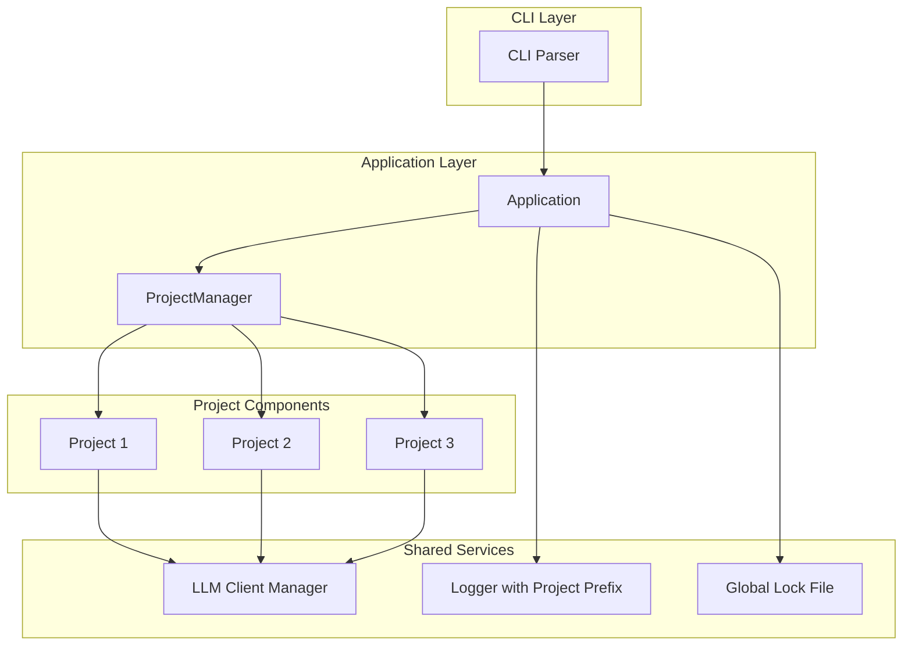
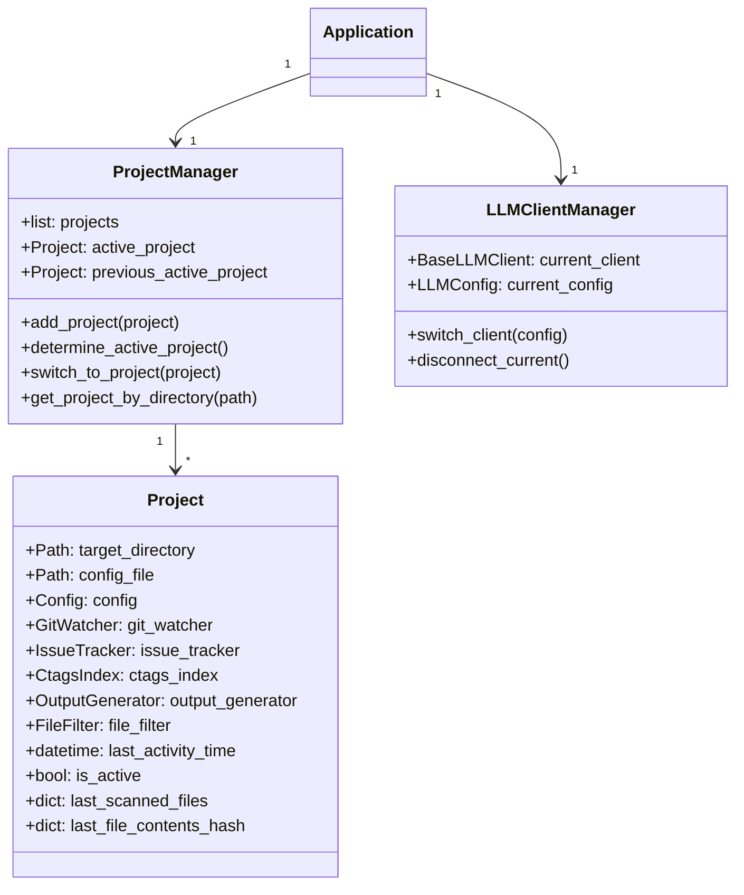

# Multi-Project Support Implementation Plan

## Overview

This document outlines the implementation of multi-project support for code scanner, allowing it to monitor multiple directories (projects) simultaneously and automatically switch between them based on most recent changes.

## Requirements Summary

Based on user requirements:
- **CLI**: Accept multiple project-config pairs (e.g., `code-scanner /path/to/project1 -c /path/to/config1.toml /path/to/project2 -c /path/to/config2.toml`)
- **Output**: Separate output files in each project directory
- **Lock File**: Single instance monitors all projects (one global lock)
- **Active Project**: Determined by most recent changes using existing git change detection algorithm
- **State Persistence**: Not persisted across restarts (start fresh each time)
- **LLM Switching**: Disconnect and reconnect ONLY when LLM configs differ between projects; non-blocking switch
- **Backward Compatibility**: Single project mode must continue to work
- **Logging**: Single global log with project prefixes
- **Ctags**: Index only for active project, regenerate on switch
- **Autostart Scripts**: Accept full CLI command string as single argument (script detects executable automatically)
- **Code Quality**: Improve test coverage to 95%+, detect and remove legacy/unused/unreachable code, mark test-only code with `_` prefix

## Architecture Design

### High-Level Architecture



### Project State Management



### Project Switching Flow

```mermaid
sequenceDiagram
    participant Scanner
    participant ProjectManager
    participant GitWatcher1 as GitWatcher (Active)
    participant GitWatcher2 as GitWatcher (Inactive)
    participant LLMManager
    participant LLMClient
    
    Scanner->>ProjectManager: Check for changes
    ProjectManager->>GitWatcher1: get_state()
    GitWatcher1-->>ProjectManager: GitState (changes)
    ProjectManager->>GitWatcher2: get_state()
    GitWatcher2-->>ProjectManager: GitState (more recent)
    
    ProjectManager->>ProjectManager: Compare activity times
    ProjectManager->>ProjectManager: Project 2 more recent
    
    Note over ProjectManager: Wait for current check to complete
    
    Scanner->>ProjectManager: Current check completed
    ProjectManager->>LLMManager: Request switch to Project 2 config
    
    alt Configs differ
        LLMManager->>LLMClient: disconnect()
        LLMClient-->>LLMManager: Disconnected
        LLMManager->>LLMManager: Create new client for Project 2
        LLMManager->>LLMClient: connect()
        LLMClient-->>LLMManager: Connected
    else Configs same
        LLMManager-->>ProjectManager: Reusing existing client
    
    ProjectManager->>ProjectManager: Set Project 2 as active
    ProjectManager->>Scanner: Resume scanning with Project 2
```

## Implementation Details

### 1. Data Model Changes

#### New Model: `Project` (src/code_scanner/models.py)

```python
@dataclass
class Project:
    """Represents a monitored project with all its components."""
    
    project_id: str  # Unique identifier (e.g., "project_1")
    target_directory: Path
    config_file: Path
    config: Config
    git_watcher: Optional[GitWatcher] = None
    issue_tracker: Optional[IssueTracker] = None
    ctags_index: Optional[CtagsIndex] = None
    output_generator: Optional[OutputGenerator] = None
    file_filter: Optional[FileFilter] = None
    
    # State tracking
    last_activity_time: float = 0.0  # Unix timestamp
    is_active: bool = False
    last_scanned_files: set[str] = field(default_factory=set)
    last_file_contents_hash: dict[str, int] = field(default_factory=dict)
    
    @property
    def output_path(self) -> Path:
        """Get output file path for this project."""
        return self.target_directory / self.config.output_file
```

### 2. Project Manager (src/code_scanner/project_manager.py)

```python
class ProjectManager:
    """Manages multiple projects and handles project switching."""
    
    def __init__(self):
        self._projects: dict[str, Project] = {}
        self._active_project_id: Optional[str] = None
        self._previous_active_project_id: Optional[str] = None
        self._lock = threading.Lock()
    
    def add_project(self, project_id: str, target_directory: Path, 
                   config_file: Path, config: Config) -> Project:
        """Add a new project to monitor."""
        project = Project(
            project_id=project_id,
            target_directory=target_directory,
            config_file=config_file,
            config=config,
        )
        with self._lock:
            self._projects[project_id] = project
        return project
    
    def determine_active_project(self) -> Optional[Project]:
        """Determine which project should be active based on most recent changes.
        
        Uses existing git change detection algorithm from GitWatcher.
        The project with the highest max mtime_ns among changed files becomes active.
        """
        with self._lock:
            if not self._projects:
                return None
            
            if len(self._projects) == 1:
                return next(iter(self._projects.values()))
            
            # Get git state for all projects
            project_activity: dict[str, float] = {}
            for project_id, project in self._projects.items():
                if project.git_watcher is None:
                    continue
                
                state = project.git_watcher.get_state()
                if state.has_changes:
                    # Find max mtime among changed files
                    max_mtime = max(
                        (f.mtime_ns for f in state.changed_files if f.mtime_ns is not None),
                        default=0.0
                    )
                    project_activity[project_id] = max_mtime
            
            # Find project with highest activity
            if not project_activity:
                # No changes in any project, keep current active
                return self.get_active_project()
            
            most_active_id = max(project_activity, key=project_activity.get)
            return self._projects[most_active_id]
    
    def switch_to_project(self, project: Project) -> None:
        """Switch to a different project.
        
        This is non-blocking - waits for current check to complete.
        """
        with self._lock:
            if self._active_project_id == project.project_id:
                return  # Already active
            
            self._previous_active_project_id = self._active_project_id
            self._active_project_id = project.project_id
            
            # Update project states
            for p in self._projects.values():
                p.is_active = (p.project_id == project.project_id)
    
    def get_active_project(self) -> Optional[Project]:
        """Get currently active project."""
        with self._lock:
            return self._projects.get(self._active_project_id) if self._active_project_id else None
    
    def get_previous_active_project(self) -> Optional[Project]:
        """Get previously active project."""
        with self._lock:
            return self._projects.get(self._previous_active_project_id) if self._previous_active_project_id else None
    
    def get_all_projects(self) -> list[Project]:
        """Get all projects."""
        with self._lock:
            return list(self._projects.values())
```

### 3. LLM Client Manager (src/code_scanner/llm_client_manager.py)

```python
class LLMClientManager:
    """Manages LLM client lifecycle for multi-project support."""
    
    def __init__(self):
        self._current_client: Optional[BaseLLMClient] = None
        self._current_config: Optional[LLMConfig] = None
        self._lock = threading.Lock()
    
    def switch_client(self, config: LLMConfig) -> BaseLLMClient:
        """Switch to a different LLM client configuration.
        
        IMPORTANT: Only disconnects and reconnects if configs are different.
        If configs are the same, reuses existing client.
        This is non-blocking - disconnects after current operations complete.
        Returns the current client (may be new or reused).
        """
        with self._lock:
            # Check if we need to switch
            if self._current_config is not None and self._configs_equal(
                self._current_config, config
            ):
                # Configs are the same - reuse existing client
                return self._current_client
            
            # Configs differ - disconnect current and create new
            self._disconnect_current()
            
            # Create new client
            new_client = create_llm_client_from_config(config)
            self._current_client = new_client
            self._current_config = config
            
            return new_client
    
    def get_current_client(self) -> Optional[BaseLLMClient]:
        """Get current LLM client."""
        with self._lock:
            return self._current_client
    
    def _disconnect_current(self) -> None:
        """Disconnect current client if it exists."""
        if self._current_client is not None:
            # Note: BaseLLMClient doesn't have explicit disconnect
            # We just release the reference and let it be garbage collected
            self._current_client = None
            self._current_config = None
    
    def _configs_equal(self, config1: LLMConfig, config2: LLMConfig) -> bool:
        """Check if two LLM configs are functionally equivalent."""
        return (
            config1.backend == config2.backend and
            config1.host == config2.host and
            config1.port == config2.port and
            config1.model == config2.model and
            config1.context_limit == config2.context_limit
        )
```

### 4. CLI Changes (src/code_scanner/cli.py)

#### Updated Argument Parsing

```python
def parse_args() -> argparse.Namespace:
    """Parse command line arguments."""
    parser = argparse.ArgumentParser(
        prog="code-scanner",
        description="AI-driven code scanner for identifying issues in uncommitted changes",
    )

    # Support multiple project-config pairs
    parser.add_argument(
        "projects",
        nargs="+",
        type=str,
        help="Project directories and configs: <dir1> -c <config1> <dir2> -c <config2> ...",
    )

    parser.add_argument(
        "-c", "--config",
        type=Path,
        default=None,
        action="append",  # Allow multiple -c flags
        help="Path to configuration file (can be specified multiple times)",
    )

    parser.add_argument(
        "--commit",
        type=str,
        default=None,
        action="append",  # Allow multiple --commit flags
        help="Git commit hash to compare against (can be specified multiple times)",
    )

    parser.add_argument(
        "--version",
        action="version",
        version="%(prog)s 0.1.0",
    )

    parser.add_argument(
        "-d", "--debug",
        action="store_true",
        default=False,
        help="Enable debug logging to console and log file",
    )

    return parser.parse_args()

def parse_project_configs(args: argparse.Namespace) -> list[tuple[Path, Path, Optional[str]]]:
    """Parse project-config pairs from CLI arguments.
    
    Returns list of (target_directory, config_file, commit_hash) tuples.
    Supports both formats:
    1. <dir1> -c <config1> <dir2> -c <config2>
    2. <dir1> <dir2> -c <config1> -c <config2> (configs in order)
    """
    projects = []
    args_list = args.projects
    
    # Separate directories and flags
    directories = []
    configs = args.config or []
    commits = args.commit or []
    
    # Extract directories (non-flag arguments)
    for arg in args_list:
        if not arg.startswith("-"):
            directories.append(Path(arg))
    
    # Validate counts
    if len(directories) == 0:
        raise ConfigError("At least one project directory must be specified")
    
    if len(configs) == 0:
        # Use default config locations
        configs = [d / "code_scanner_config.toml" for d in directories]
    elif len(configs) != len(directories):
        raise ConfigError(
            f"Number of configs ({len(configs)}) must match "
            f"number of directories ({len(directories)})"
        )
    
    # Pad commits list if needed
    while len(commits) < len(directories):
        commits.append(None)
    
    # Build project tuples
    for i, (directory, config) in enumerate(zip(directories, configs)):
        projects.append((directory, config, commits[i]))
    
    return projects
```

### 5. Application Class Updates (src/code_scanner/cli.py)

```python
class Application:
    """Main application coordinator with multi-project support."""

    def __init__(self, projects: list[tuple[Path, Path, Optional[str]]], debug: bool = False):
        """Initialize application.
        
        Args:
            projects: List of (target_directory, config_file, commit_hash) tuples.
            debug: Enable debug logging.
        """
        self._project_configs = projects
        self._debug = debug
        
        # Multi-project components
        self.project_manager = ProjectManager()
        self.llm_client_manager = LLMClientManager()
        
        # Single instance components (shared)
        self._stop_event = threading.Event()
        self._lock_acquired = False
        
        # Legacy single-project support (backward compatibility)
        self._single_project_mode = len(projects) == 1

    def run(self) -> int:
        """Run the application."""
        try:
            self._setup()
            self._run_main_loop()
            return 0
        except (ConfigError, GitError, LLMClientError, LockFileError, 
                CtagsNotFoundError, CtagsError, RipgrepNotFoundError) as e:
            logger.error(str(e))
            return 1
        except KeyboardInterrupt:
            logger.info("Interrupted by user")
            return 130
        except SystemExit:
            raise
        except Exception as e:
            logger.error(f"Unexpected error: {e}", exc_info=True)
            return 1
        finally:
            self._cleanup()

    def _setup(self) -> None:
        """Set up all projects and components."""
        # Print paths
        print(f"Log file: {Path.home() / '.code-scanner' / 'code_scanner.log'}")
        print(f"Lock file: {Path.home() / '.code-scanner' / 'code_scanner.lock'}")
        
        # Check and acquire lock
        self._acquire_lock()
        
        # Set up logging with project prefix support
        setup_logging(
            log_path=Path.home() / '.code-scanner' / 'code_scanner.log',
            debug=self._debug,
            project_manager=self.project_manager if not self._single_project_mode else None
        )
        
        # Initialize all projects
        for i, (target_dir, config_file, commit_hash) in enumerate(self._project_configs):
            project_id = f"project_{i}"
            logger.info(f"Initializing project {project_id}: {target_dir}")
            
            # Load config
            config = load_config(
                target_directory=target_dir,
                config_file=config_file,
                commit_hash=commit_hash,
                debug=self._debug,
            )
            
            # Add to project manager
            self.project_manager.add_project(
                project_id=project_id,
                target_directory=target_dir,
                config_file=config_file,
                config=config,
            )
            
            # Initialize project components
            project = self.project_manager._projects[project_id]
            self._initialize_project_components(project)
        
        # Determine initial active project
        active_project = self.project_manager.determine_active_project()
        if active_project:
            self.project_manager.switch_to_project(active_project)
            logger.info(f"Initial active project: {active_project.project_id} ({active_project.target_directory})")
        
        # Initialize LLM client for active project
        if active_project:
            self.llm_client_manager.switch_client(active_project.config.llm)
        
        # Log startup info
        if self._single_project_mode:
            logger.info(
                f"{'=' * 60}\n"
                f"Code Scanner starting (single-project mode)\n"
                f"Target directory: {active_project.target_directory}\n"
                f"Config file: {active_project.config_file}\n"
                f"{'=' * 60}"
            )
        else:
            logger.info(
                f"{'=' * 60}\n"
                f"Code Scanner starting (multi-project mode)\n"
                f"Monitoring {len(self._project_configs)} project(s)\n"
                f"Active project: {active_project.project_id if active_project else 'None'}\n"
                f"{'=' * 60}"
            )
    
    def _initialize_project_components(self, project: Project) -> None:
        """Initialize all components for a project."""
        config = project.config
        
        # Create scanner files to exclude
        scanner_files = {
            config.output_file,
            f"{config.output_file}.bak",
            config.log_file,
        }
        
        # Collect config ignore patterns
        config_ignore_patterns: list[str] = []
        for group in config.check_groups:
            if not group.checks:
                config_ignore_patterns.extend(
                    p.strip() for p in group.pattern.split(",")
                )
        
        # Create file filter
        project.file_filter = FileFilter(
            repo_path=config.target_directory,
            scanner_files=scanner_files,
            config_ignore_patterns=config_ignore_patterns,
            load_gitignore=True,
        )
        
        # Create git watcher
        project.git_watcher = GitWatcher(
            config.target_directory,
            config.commit_hash,
            excluded_files=scanner_files,
            file_filter=project.file_filter,
        )
        project.git_watcher.connect()
        
        # Create issue tracker
        project.issue_tracker = IssueTracker()
        
        # Create output generator
        project.output_generator = OutputGenerator(project.output_path)
        
        # Create initial output file
        self._backup_existing_output(project)
        project.output_generator.write(
            project.issue_tracker, 
            {"status": "Scanning in progress..."}
        )
        
        # Ctags index will be created when project becomes active
    
    def _run_main_loop(self) -> None:
        """Run main application loop with project switching."""
        # Set up signal handlers
        signal.signal(signal.SIGINT, self._signal_handler)
        signal.signal(signal.SIGTERM, self._signal_handler)
        
        # Create scanner for active project
        self._scanner = None
        self._start_scanner_for_active_project()
        
        # Main loop
        logger.info("Scanner running. Press Ctrl+C to stop.")
        while not self._stop_event.is_set():
            try:
                # Check if we should switch projects
                new_active = self.project_manager.determine_active_project()
                current_active = self.project_manager.get_active_project()
                
                if new_active and new_active.project_id != current_active.project_id:
                    logger.info(
                        f"Switching active project: {current_active.project_id} -> {new_active.project_id}"
                    )
                    self._switch_projects(current_active, new_active)
                
                # Sleep briefly
                time.sleep(0.5)
                
            except Exception as e:
                logger.error(f"Main loop error: {e}", exc_info=True)
                time.sleep(5)
    
    def _start_scanner_for_active_project(self) -> None:
        """Start scanner for currently active project."""
        active_project = self.project_manager.get_active_project()
        if not active_project:
            return
        
        # Stop existing scanner if running
        if self._scanner is not None:
            self._scanner.stop()
        
        # Initialize ctags index for active project
        if active_project.ctags_index is None:
            logger.info(f"Generating ctags index for {active_project.project_id}...")
            active_project.ctags_index = CtagsIndex(active_project.target_directory)
            active_project.ctags_index.generate_index_async()
        
        # Get LLM client (switches only if configs differ)
        llm_client = self.llm_client_manager.switch_client(active_project.config.llm)
        if llm_client and not self.llm_client_manager._current_config:
            # New client was created, need to connect
            llm_client.connect()
            logger.info(f"Connected to {llm_client.backend_name}")
        
        # Set context limit
        llm_client.set_context_limit(active_project.config.llm.context_limit)
        
        # Create and start scanner
        self._scanner = Scanner(
            config=active_project.config,
            git_watcher=active_project.git_watcher,
            llm_client=llm_client,
            issue_tracker=active_project.issue_tracker,
            output_generator=active_project.output_generator,
            ctags_index=active_project.ctags_index,
            file_filter=active_project.file_filter,
        )
        self._scanner.start()
    
    def _switch_projects(self, from_project: Project, to_project: Project) -> None:
        """Switch from one project to another.
        
        This is non-blocking - waits for current check to complete.
        """
        logger.info(f"Waiting for current check to complete before switching...")
        
        # Wait for scanner to finish current check
        # Scanner will detect stop event and complete gracefully
        if self._scanner:
            self._scanner.stop()
            self._scanner = None
        
        # Switch LLM client (only disconnects/reconnects if configs differ)
        llm_client = self.llm_client_manager.switch_client(to_project.config.llm)
        if llm_client and self.llm_client_manager._current_config != from_project.config.llm:
            # Configs differ, new client was created
            llm_client.connect()
            logger.info(f"Connected to {llm_client.backend_name}")
        
        # Update project manager
        self.project_manager.switch_to_project(to_project)
        
        # Start scanner for new active project
        self._start_scanner_for_active_project()
        
        logger.info(f"Project switch complete: {to_project.project_id} is now active")
    
    def _backup_existing_output(self, project: Project) -> None:
        """Backup existing output file for a project."""
        output_path = project.output_path
        
        if output_path.exists():
            backup_path = output_path.parent / f"{output_path.name}.bak"
            timestamp = datetime.now(timezone.utc).strftime('%Y-%m-%d %H:%M:%S UTC')
            
            try:
                content = output_path.read_text(encoding='utf-8')
                
                with open(backup_path, "a", encoding='utf-8') as f:
                    f.write(f"\n\n{'=' * 60}\n")
                    f.write(f"Backup created: {timestamp}\n")
                    f.write(f"{'=' * 60}\n\n")
                    f.write(content)
                
                logger.info(f"Backed up output for {project.project_id} to {backup_path}")
                output_path.unlink()
                
            except IOError as e:
                logger.warning(f"Could not backup output for {project.project_id}: {e}")
```

### 6. Logging with Project Prefixes (src/code_scanner/utils.py)

```python
class ProjectPrefixFormatter(logging.Formatter):
    """Log formatter that adds project prefix to messages."""
    
    def __init__(self, project_manager: ProjectManager):
        super().__init__()
        self.project_manager = project_manager
    
    def format(self, record: logging.LogRecord) -> str:
        """Format log record with project prefix."""
        active_project = self.project_manager.get_active_project()
        
        if active_project:
            prefix = f"[{active_project.project_id}] "
        else:
            prefix = "[SYSTEM] "
        
        # Add prefix to message
        original_msg = record.msg
        if isinstance(original_msg, str):
            record.msg = prefix + original_msg
        
        return super().format(record)

def setup_logging(log_path: Path, debug: bool, 
                project_manager: Optional[ProjectManager] = None) -> None:
    """Set up logging with optional project prefix support."""
    log_path.parent.mkdir(parents=True, exist_ok=True)
    
    # Create formatters
    console_formatter = ColoredFormatter() if sys.stdout.isatty() else logging.Formatter()
    file_formatter = logging.Formatter(
        '%(asctime)s - %(name)s - %(levelname)s - %(message)s'
    )
    
    # Add project prefix if project manager provided
    if project_manager:
        console_formatter = ProjectPrefixFormatter(project_manager)
        file_formatter = ProjectPrefixFormatter(project_manager)
    
    # Configure root logger
    root_logger = logging.getLogger()
    root_logger.setLevel(logging.DEBUG if debug else logging.INFO)
    
    # Console handler
    console_handler = logging.StreamHandler(sys.stdout)
    console_handler.setFormatter(console_formatter)
    root_logger.addHandler(console_handler)
    
    # File handler
    file_handler = logging.FileHandler(log_path)
    file_handler.setFormatter(file_formatter)
    root_logger.addHandler(file_handler)
```

### 7. Autostart Script Updates

#### Linux (scripts/autostart-linux.sh)

```bash
# Updated to support multiple projects via full CLI command string
install_service() {
    local full_command="$1"
    
    # Validate command is provided
    if [ -z "$full_command" ]; then
        print_error "Full CLI command must be provided"
        echo ""
        echo "Usage: $0 install \"<full CLI command>\""
        echo ""
        echo "Example:"
        echo "  $0 install \"code-scanner /path/to/project1 -c /path/to/config1.toml /path/to/project2 -c /path/to/config2.toml\""
        exit 1
    fi
    
    # Find code-scanner
    local scanner_cmd
    scanner_cmd=$(find_code_scanner)
    
    # Build command with 60-second delay
    local exec_start="sleep 60 && $full_command"
    
    # Test launch
    print_info "Testing code-scanner launch..."
    print_info "Command: $exec_start"
    echo ""
    
    # Run for 5 seconds, capture output
    local output
    output=$(timeout 5s bash -c "$exec_start" 2>&1 | head -30) || true
    
    echo "$output"
    echo ""
    
    # Check for success indicators
    if echo "$output" | grep -q "Scanner running\|Scanner loop started\|Scanner thread started"; then
        print_success "Test launch succeeded - scanner started correctly."
        return 0
    fi
    
    # Check for common error patterns
    if echo "$output" | grep -qi "error\|failed\|exception\|traceback\|could not\|cannot\|refused"; then
        print_error "Test launch failed. Please fix the issues above and try again."
        exit 1
    fi
    
    # No clear success or failure - warn but continue
    print_warning "Could not automatically verify launch success."
    print_warning "Please check the output above and ensure code-scanner starts correctly."
    read -p "Continue with installation? (y/N): " response
    if [[ ! "$response" =~ ^[Yy]$ ]]; then
        print_error "Installation cancelled."
        exit 1
    fi
    
    # Check for legacy configuration
    check_legacy "$exec_start"
    
    # Create service directory
    mkdir -p "$USER_SERVICE_DIR"
    
    # Create systemd service file
    print_info "Creating systemd service file..."
    cat > "$SERVICE_FILE" << EOF
[Unit]
Description=Code Scanner - AI-driven code analysis
After=network.target

[Service]
Type=simple
ExecStart=/bin/bash -c '$exec_start'
Restart=no
Environment=HOME=$HOME
Environment=PATH=$PATH

[Install]
WantedBy=default.target
EOF

    print_success "Created service file: $SERVICE_FILE"
    
    # Reload systemd and enable service
    print_info "Enabling and starting service..."
    systemctl --user daemon-reload
    systemctl --user enable "$SERVICE_NAME"
    systemctl --user start "$SERVICE_NAME"
    
    print_success "Code Scanner autostart installed successfully!"
    echo ""
    print_info "Useful commands:"
    echo "  systemctl --user status $SERVICE_NAME  # Check status"
    echo "  systemctl --user stop $SERVICE_NAME    # Stop service"
    echo "  systemctl --user start $SERVICE_NAME   # Start service"
    echo "  journalctl --user -u $SERVICE_NAME     # View logs"
}
```

#### macOS (scripts/autostart-macos.sh)

```bash
# Updated to support multiple projects via full CLI command string
install_service() {
    local full_command="$1"
    
    # Validate command is provided
    if [ -z "$full_command" ]; then
        print_error "Full CLI command must be provided"
        echo ""
        echo "Usage: $0 install \"<full CLI command>\""
        echo ""
        echo "Example:"
        echo "  $0 install \"code-scanner /path/to/project1 -c /path/to/config1.toml /path/to/project2 -c /path/to/config2.toml\""
        exit 1
    fi
    
    # Find code-scanner
    local scanner_cmd
    scanner_cmd=$(find_code_scanner)
    
    # Test launch
    print_info "Testing code-scanner launch..."
    print_info "Command: $full_command"
    echo ""
    
    # Run for 5 seconds, capture output
    local output
    output=$(timeout 5s bash -c "$full_command" 2>&1 | head -30) || true
    
    echo "$output"
    echo ""
    
    # Check for success indicators
    if echo "$output" | grep -q "Scanner running\|Scanner loop started\|Scanner thread started"; then
        print_success "Test launch succeeded - scanner started correctly."
        return 0
    fi
    
    # Check for common error patterns
    if echo "$output" | grep -qi "error\|failed\|exception\|traceback\|could not\|cannot\|refused"; then
        print_error "Test launch failed. Please fix the issues above and try again."
        exit 1
    fi
    
    # No clear success or failure - warn but continue
    print_warning "Could not automatically verify launch success."
    print_warning "Please check the output above and ensure code-scanner starts correctly."
    read -p "Continue with installation? (y/N): " response
    if [[ ! "$response" =~ ^[Yy]$ ]]; then
        print_error "Installation cancelled."
        exit 1
    fi
    
    # Check for legacy configuration
    check_legacy "$full_command"
    
    # Create LaunchAgents directory
    mkdir -p "$LAUNCH_AGENTS_DIR"
    
    # Create wrapper script with 60-second delay
    local wrapper_script="$HOME/.code-scanner/launch-wrapper.sh"
    mkdir -p "$(dirname "$wrapper_script")"
    cat > "$wrapper_script" << EOF
#!/bin/bash
# Code Scanner launch wrapper with startup delay
sleep 60
exec $full_command
EOF
    chmod +x "$wrapper_script"
    
    # Create plist file
    print_info "Creating LaunchAgent plist..."
    cat > "$PLIST_FILE" << EOF
<?xml version="1.0" encoding="UTF-8"?>
<!DOCTYPE plist PUBLIC "-//Apple//DTD PLIST 1.0//EN" "http://www.apple.com/DTDs/PropertyList-1.0.dtd">
<plist version="1.0">
<dict>
    <key>Label</key>
    <string>$SERVICE_NAME</string>
    <key>ProgramArguments</key>
    <array>
        <string>/bin/bash</string>
        <string>$wrapper_script</string>
    </array>
    <key>RunAtLoad</key>
    <true/>
    <key>KeepAlive</key>
    <false/>
    <key>StandardOutPath</key>
    <string>$HOME/.code-scanner/launchd-stdout.log</string>
    <key>StandardErrorPath</key>
    <string>$HOME/.code-scanner/launchd-stderr.log</string>
    <key>EnvironmentVariables</key>
    <dict>
        <key>HOME</key>
        <string>$HOME</string>
        <key>PATH</key>
        <string>$PATH</string>
    </dict>
</dict>
</plist>
EOF

    print_success "Created plist file: $PLIST_FILE"
    
    # Load service
    print_info "Loading LaunchAgent..."
    launchctl load "$PLIST_FILE"
    
    print_success "Code Scanner autostart installed successfully!"
    echo ""
    print_info "Useful commands:"
    echo "  launchctl list | grep code-scanner   # Check if running"
    echo "  launchctl unload \"$PLIST_FILE\"     # Stop service"
    echo "  launchctl load \"$PLIST_FILE\"       # Start service"
    echo "  cat ~/.code-scanner/launchd-*.log   # View logs"
}
```

#### Windows (scripts/autostart-windows.bat)

```batch
REM Updated to support multiple projects via full CLI command string
:install
if "%~1"=="" (
    echo [ERROR] Full CLI command must be provided
    echo.
    echo Usage: %~nx0 install "<full CLI command>"
    echo.
    echo Example:
    echo   %~nx0 install "code-scanner C:\path\to\project1 -c C:\path\to\config1.toml C:\path\to\project2 -c C:\path\to\config2.toml"
    exit /b 1
)

set "FULL_COMMAND=%~1"

REM Find code-scanner
set "SCANNER_CMD="
where code-scanner >nul 2>&1 && set "SCANNER_CMD=code-scanner"
if "%SCANNER_CMD%"=="" (
    where uv >nul 2>&1 && set "SCANNER_CMD=uv run code-scanner"
)
if "%SCANNER_CMD%"=="" (
    echo [ERROR] Could not find code-scanner or uv. Please install code-scanner first.
    exit /b 1
)

echo [INFO] Testing code-scanner launch...
echo [INFO] Command: %FULL_COMMAND%
echo.

REM Test launch - run for 5 seconds and capture output
set "TEST_OUTPUT=%TEMP%\code-scanner-test.txt"
start /b cmd /c ""%SCANNER_CMD% %FULL_COMMAND% 2>&1" > "%TEST_OUTPUT%" 2>&1
timeout /t 5 /nobreak >nul 2>&1

REM Kill any running code-scanner processes from test
taskkill /f /im code-scanner.exe >nul 2>&1
taskkill /f /im python.exe /fi "WINDOWTITLE eq code-scanner*" >nul 2>&1

REM Display output
if exist "%TEST_OUTPUT%" (
    type "%TEST_OUTPUT%"
    echo.
    
    REM Check for success indicators
    findstr /i "Scanner running Scanner loop started Scanner thread started" "%TEST_OUTPUT%" >nul 2>&1
    if not errorlevel 1 (
        echo [SUCCESS] Test launch succeeded - scanner started correctly.
        del "%TEST_OUTPUT%" >nul 2>&1
        goto :test_passed
    )
    
    REM Check for error indicators
    findstr /i "error failed exception traceback could not cannot refused" "%TEST_OUTPUT%" >nul 2>&1
    if not errorlevel 1 (
        echo [ERROR] Test launch failed. Please fix the issues above and try again.
        del "%TEST_OUTPUT%" >nul 2>&1
        exit /b 1
    )
    
    del "%TEST_OUTPUT%" >nul 2>&1
)

REM No clear success or failure - ask user
echo [WARNING] Could not automatically verify launch success.
echo [WARNING] Please check the output above and ensure code-scanner starts correctly.
set /p "RESPONSE=Continue with installation? (y/N): "
if /i not "%RESPONSE%"=="y" (
    echo [ERROR] Installation cancelled.
    exit /b 1
)

:test_passed

REM Check for existing task
schtasks /query /tn "%TASK_NAME%" >nul 2>&1
if not errorlevel 1 (
    echo [WARNING] Found existing autostart task.
    set /p "REPLACE=Replace existing configuration? (y/N): "
    if /i not "%REPLACE%"=="y" (
        echo [INFO] Installation cancelled.
        exit /b 0
    )
    echo [INFO] Removing existing task...
    schtasks /delete /tn "%TASK_NAME%" /f >nul 2>&1
)

REM Create wrapper script with 60-second delay
set "HOME_DIR=%USERPROFILE%\.code-scanner"
if not exist "%HOME_DIR%" mkdir "%HOME_DIR%"

set "WRAPPER_SCRIPT=%HOME_DIR%\launch-wrapper.bat"
(
    echo @echo off
    echo REM Code Scanner launch wrapper with startup delay
    echo timeout /t 60 /nobreak ^>nul
    echo %FULL_COMMAND%
) > "%WRAPPER_SCRIPT%"

REM Create scheduled task to run at logon
echo [INFO] Creating scheduled task...
schtasks /create /tn "%TASK_NAME%" /tr "\"%WRAPPER_SCRIPT%\"" /sc onlogon /rl highest /f

if errorlevel 1 (
    echo [ERROR] Failed to create scheduled task.
    exit /b 1
)

echo [SUCCESS] Code Scanner autostart installed successfully!
echo.
echo [INFO] Useful commands:
echo   schtasks /query /tn "%TASK_NAME%"         # Check status
echo   schtasks /run /tn "%TASK_NAME%"           # Start manually
echo   schtasks /end /tn "%TASK_NAME%"           # Stop task
echo   schtasks /delete /tn "%TASK_NAME%" /f     # Remove task
exit /b 0
```

## Testing Strategy

### Unit Tests

1. **ProjectManager Tests** (tests/test_project_manager.py)
   - Test adding projects
   - Test determining active project based on changes
   - Test project switching
   - Test concurrent access with threading

2. **LLMClientManager Tests** (tests/test_llm_client_manager.py)
   - Test client switching
   - Test config comparison
   - Test reusing same client when configs match
   - Test that disconnect only happens when configs differ

3. **Multi-Project CLI Tests** (tests/test_cli_multi_project.py)
   - Test parsing multiple project-config pairs
   - Test backward compatibility with single project
   - Test error handling for invalid arguments

4. **Application Multi-Project Tests** (tests/test_application_multi_project.py)
   - Test initialization with multiple projects
   - Test project switching during runtime
   - Test state preservation during switches

### Integration Tests

1. **Multi-Project Scanning** (tests/test_multi_project_integration.py)
   - Test scanning multiple projects simultaneously
   - Test automatic project switching
   - Test output files for each project

2. **LLM Switching** (tests/test_llm_switching.py)
   - Test switching between different backends (LM Studio <-> Ollama)
   - Test switching between different models
   - Test connection handling during switches
   - Test that same config reuses client

### Code Quality Improvements

1. **Improve Test Coverage**
   - Run coverage analysis: `uv run pytest --cov=code_scanner --cov-report=term-missing`
   - Identify uncovered code paths
   - Write tests to reach 95%+ coverage

2. **Detect and Remove Legacy Code**
   - Search for TODO comments indicating temporary/old code
   - Search for commented-out code blocks
   - Remove or document why it's kept

3. **Detect and Remove Unused Code**
   - Use tools like `pylint` or `ruff` to find unused imports/variables
   - Search for functions/classes that are never called
   - Remove or mark with `_` prefix if test-only

4. **Detect and Remove Unreachable Code**
   - Analyze code paths for dead code
   - Remove `return` statements after unreachable code
   - Remove code after `raise` or `exit()` calls

5. **Mark Test-Only Code**
   - Identify functions/methods used only in tests
   - Mark with `_` prefix (e.g., `_test_helper_function()`)
   - Add comment: `# Test-only: Used in tests only`
   - Keep if functionality is useful for testing

## Documentation Updates

### PRD.md Updates

Add new section:

```markdown
### 2.8 Multi-Project Support

*   **Multiple Projects:** The scanner can monitor multiple directories (projects) simultaneously.
*   **CLI Format:** Projects are specified as directory-config pairs:
    ```
    code-scanner /path/to/project1 -c /path/to/config1.toml /path/to/project2 -c /path/to/config2.toml
    ```
*   **Active Project:** Only one project is active at a time for scanning.
*   **Automatic Switching:** The project with the most recent changes (based on git change detection) automatically becomes active.
*   **State Preservation:** Each project maintains its own issue tracker state in memory. Switching between projects preserves the state of inactive projects.
*   **LLM Switching:** When switching between projects with different AI models, the old model is disconnected after completing the current check, and the new model is connected. If models are the same, the existing connection is reused.
*   **Output Files:** Each project has its own output file in its directory (`code_scanner_results.md`).
*   **Logging:** All projects log to a single global log file with project prefixes for identification.
*   **Ctags Index:** The ctags index is generated only for the active project and regenerated when switching.
*   **Backward Compatibility:** Single-project mode continues to work as before.
*   **Lock File:** A single global lock file prevents multiple scanner instances, regardless of project count.
*   **Autostart:** Autostart scripts accept a full CLI command string as a single argument.
```

### README.md Updates

Add new section:

```markdown
## Multi-Project Support

The code scanner can monitor multiple projects simultaneously and automatically switch between them based on most recent changes.

### Usage

Monitor multiple projects:

```bash
code-scanner /path/to/project1 -c /path/to/config1.toml \
              /path/to/project2 -c /path/to/config2.toml \
              /path/to/project3 -c /path/to/config3.toml
```

### How It Works

1. **Initialization**: All specified projects are initialized with their individual configs.
2. **Active Project**: Only one project is actively scanned at a time.
3. **Automatic Switching**: The scanner monitors all projects and automatically switches to the one with the most recent changes.
4. **State Preservation**: Each project maintains its own issue state. Switching preserves inactive project states.
5. **Model Switching**: If projects use different AI models, the scanner switches models seamlessly after completing the current check. If models are the same, the existing connection is reused.

### Output

Each project generates its own output file:
- `project1/code_scanner_results.md`
- `project2/code_scanner_results.md`
- `project3/code_scanner_results.md`

### Autostart with Multiple Projects

```bash
# Linux
./scripts/autostart-linux.sh install \
    "code-scanner /path/to/project1 -c /path/to/config1.toml /path/to/project2 -c /path/to/config2.toml"

# macOS
./scripts/autostart-macos.sh install \
    "code-scanner /path/to/project1 -c /path/to/config1.toml /path/to/project2 -c /path/to/config2.toml"

# Windows
scripts\autostart-windows.bat install \
    "code-scanner C:\path\to\project1 -c C:\path\to\config1.toml C:\path\to\project2 -c C:\path\to\config2.toml"
```
```

## Implementation Order

1. Create new data models (Project)
2. Create ProjectManager class
3. Create LLMClientManager class
4. Update CLI argument parsing
5. Update Application class for multi-project support
6. Update logging with project prefixes
7. Update autostart scripts for all platforms
8. Write comprehensive tests for multi-project functionality
9. Write tests for LLM client switching and reuse
10. Improve test coverage to 95%+
11. Detect and remove legacy/unused/unreachable code
12. Mark test-only code with `_` prefix and add comments
13. Update documentation (PRD, README)
14. Verify backward compatibility with single-project mode
15. Code review and final testing

## Risk Mitigation

1. **Threading Safety**: All project manager operations use locks to prevent race conditions.
2. **Graceful Switching**: Project switching waits for current check to complete.
3. **Backward Compatibility**: Single-project mode is a special case of multi-project mode.
4. **Error Handling**: Each project's errors are isolated and don't affect other projects.
5. **Resource Management**: LLM clients are properly disconnected when switching.
6. **Testing**: Comprehensive unit and integration tests ensure reliability.
7. **LLM Reuse**: Same configs reuse existing client to avoid unnecessary reconnections.
8. **UX Consistency**: Single and multi-project modes provide consistent user experience.
